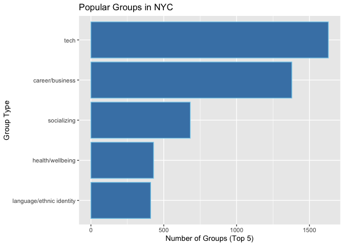
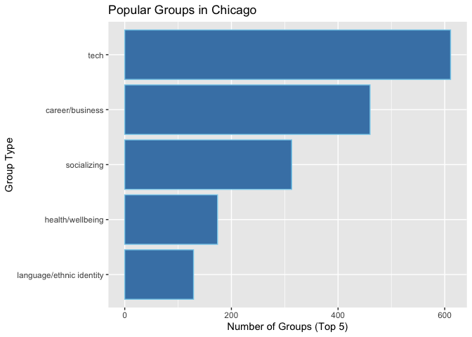
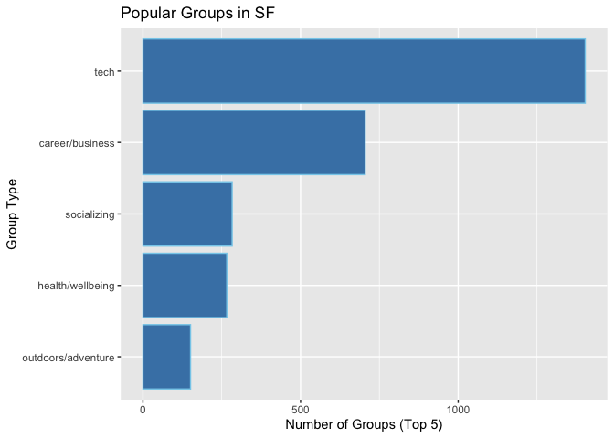

There are high demands of people who want to build groups outside of there jobs for multiple interests. Some people want to build networks for their career, some people want to learn new things and some people want to enjoy a hobby with others after work. Meetup is a service which provides an on-line group for hosting an in-person meeting for a variety of interest. I am going to explore which topics are popular in different cities. There are three cities in this dataset. New York City, San Francisco, Chicago. I will provide the top 5 topics of interest in Three cities

``` r
library(ggplot2)
library(igraph)
```

    ## 
    ## Attaching package: 'igraph'

    ## The following objects are masked from 'package:stats':
    ## 
    ##     decompose, spectrum

    ## The following object is masked from 'package:base':
    ## 
    ##     union

``` r
library(tidyverse)
```

    ## ── Attaching packages ───────────────────────────────────────────────────────────────────────────────────────────────────────────────── tidyverse 1.2.1 ──

    ## ✔ tibble  2.1.3     ✔ purrr   0.3.2
    ## ✔ tidyr   0.8.3     ✔ dplyr   0.8.1
    ## ✔ readr   1.3.1     ✔ stringr 1.4.0
    ## ✔ tibble  2.1.3     ✔ forcats 0.4.0

    ## ── Conflicts ──────────────────────────────────────────────────────────────────────────────────────────────────────────────────── tidyverse_conflicts() ──
    ## ✖ dplyr::as_data_frame() masks tibble::as_data_frame(), igraph::as_data_frame()
    ## ✖ purrr::compose()       masks igraph::compose()
    ## ✖ tidyr::crossing()      masks igraph::crossing()
    ## ✖ dplyr::filter()        masks stats::filter()
    ## ✖ dplyr::groups()        masks igraph::groups()
    ## ✖ dplyr::lag()           masks stats::lag()
    ## ✖ purrr::simplify()      masks igraph::simplify()

``` r
setwd("~/Dropbox/incubdataset")
categories <- read.csv("categories.csv")

cities <- read.csv("cities.csv")

events <- read.csv("events.csv")

groups_topics <- read.csv("groups_topics.csv")

groups <- read.csv("groups.csv")

topics <- read.csv("topics.csv")

#Loading data

groups2= groups %>% filter(city %in% c("New York","West New York"))
#filter by city
groups_topic_ny= groups2 %>%  count (category.name)
#count topic category
top5_ny=top_n(arrange(as.data.frame(groups_topic_ny),n),5,n)
#sort by count
p<-ggplot(data=top5_ny, aes(x=reorder(category.name, n), y=n)) +
  geom_bar(stat="identity", color='skyblue',fill='steelblue')
p + coord_flip() + labs(title="Popular Groups in NYC",
                        x ="Group Type", y = "Number of Groups (Top 5)")
```



``` r
#Horizontal barplot

groups2= groups %>% filter(city %in% c("Chicago","Chicago Heights","Chicago Ridge","North Chicago","West Chicago"))

groups_topic_ch= groups2 %>%  count (category.name)
top5_ch=top_n(arrange(as.data.frame( groups_topic_ch),n),5,n)

p<-ggplot(data=top5_ch, aes(x=reorder(category.name, n), y=n)) +
  geom_bar(stat="identity", color='skyblue',fill='steelblue')
p + coord_flip() + labs(title="Popular Groups in Chicago",
                        x ="Group Type", y = "Number of Groups (Top 5)")
```



``` r
groups2= groups %>% filter(city %in% c("South San Francisco","San Francisco"))
groups_topic_sf= groups2 %>%  count (category.name)
top5_sf=top_n(arrange(as.data.frame(groups_topic_sf),n),5,n)

p<-ggplot(data=top5_sf, aes(x=reorder(category.name, n), y=n)) +
  geom_bar(stat="identity", color='skyblue',fill='steelblue')

p + coord_flip() + labs(title="Popular Groups in SF",
                        x ="Group Type", y = "Number of Groups (Top 5)")
```



For all three cities first to fourth most popular topics are tech, career/business, socializing, and health/wellbing. For both Chicago and NYC language/ethnic identity is fifth. In SF, outdoor/adventure is fifth. The pattern in Chicago and NYC are similar and SF shows a different pattern. The popularity of tech is very high in SF compared to the other two cities. I think it is because SF has the best tech-based industry. Also, SF people are more interested in outdoor activity, because of its good weather in California. In the next section, I will see the association between those topics in terms of the user's choice of topic group.
