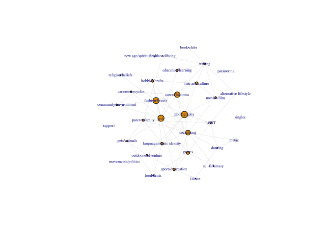

Many users join multiple groups that had different topics. I want to see is there any topics that are much closer to each other than other topics. This will be important to recommend new meetings to exist users. In this section, I will provide network between topics. The association (connection) is computed based on users who join multiple groups with different topics.

``` r
library(ggplot2)
library(igraph)
```

    ## 
    ## Attaching package: 'igraph'

    ## The following objects are masked from 'package:stats':
    ## 
    ##     decompose, spectrum

    ## The following object is masked from 'package:base':
    ## 
    ##     union

``` r
library(tidyverse)
```

    ## ── Attaching packages ───────────────────────────────────────────────────────────────────────────────────────────────────────────────── tidyverse 1.2.1 ──

    ## ✔ tibble  2.1.3     ✔ purrr   0.3.2
    ## ✔ tidyr   0.8.3     ✔ dplyr   0.8.1
    ## ✔ readr   1.3.1     ✔ stringr 1.4.0
    ## ✔ tibble  2.1.3     ✔ forcats 0.4.0

    ## ── Conflicts ──────────────────────────────────────────────────────────────────────────────────────────────────────────────────── tidyverse_conflicts() ──
    ## ✖ dplyr::as_data_frame() masks tibble::as_data_frame(), igraph::as_data_frame()
    ## ✖ purrr::compose()       masks igraph::compose()
    ## ✖ tidyr::crossing()      masks igraph::crossing()
    ## ✖ dplyr::filter()        masks stats::filter()
    ## ✖ dplyr::groups()        masks igraph::groups()
    ## ✖ dplyr::lag()           masks stats::lag()
    ## ✖ purrr::simplify()      masks igraph::simplify()

``` r
library(Matrix)
```

    ## 
    ## Attaching package: 'Matrix'

    ## The following object is masked from 'package:tidyr':
    ## 
    ##     expand

``` r
setwd("~/Dropbox/incubdataset")
categories <- read.csv("categories.csv")

cities <- read.csv("cities.csv")

events <- read.csv("events.csv")

groups_topics <- read.csv("groups_topics.csv")

groups <- read.csv("groups.csv")

topics <- read.csv("topics.csv")
#reading data

group_category=inner_join(groups_topics,groups,by = "group_id", copy = FALSE, suffix = c(".x", ".y"))
#joining two tables groups_topcs and groups

groups_topics2=arrange(group_category,category.name)
#Sort by category name
Network_matrix=matrix(0,length(unique(groups_topics2$category.name)),length(unique(groups_topics2$category.name)))
#Creating 0 matrix to create adjacency matrix
colnames(Network_matrix)=unique(groups_topics2$category.name)
rownames(Network_matrix)=unique(groups_topics2$category.name)
#col and row names with category name
for (i in 1:dim(groups_topics2)[1]){
  temp=subset(groups_topics2,groups_topics2$topic_name==groups_topics2$topic_name[i])
  Network_matrix[groups_topics2$category.name[i], unique(temp$category.name)]=Network_matrix[groups_topics2$category.name[i],unique(temp$category.name)]+1
}
#This loop add points to other categories for individual who visited one category.
#This point contributes to connection between two categories
diag(Network_matrix)=0
#0 for association between by themselves
AA=Network_matrix/rowSums(Network_matrix)*matrix(as.numeric(Network_matrix/rowSums(Network_matrix)>0.05),33,33)
#Two ignore popularity of topic, /rowSums(Network_matrix). using cutoff 0.05 to prevent too many edges
AA=(AA+t(AA))/2
#This erase the directionality of sub and main topic
G1=graph_from_adjacency_matrix(AA,weighted=TRUE,mode="undirected")
plot.igraph(G1,vertex.size=(eigen_centrality(G1)$vector)*10
            ,vertex.label.cex=0.5,edge.width=0.2)
```



``` r
#The size of circle is based on eigen centrality
```

Since I corrected the effect of popularity, there are some categories that connect different topics. Photography and fashion/beauty seems to be a common topic of interest for people who have different taste of meetings. Still, business and tech which is related to jobs are still a very commonly shared topic.
